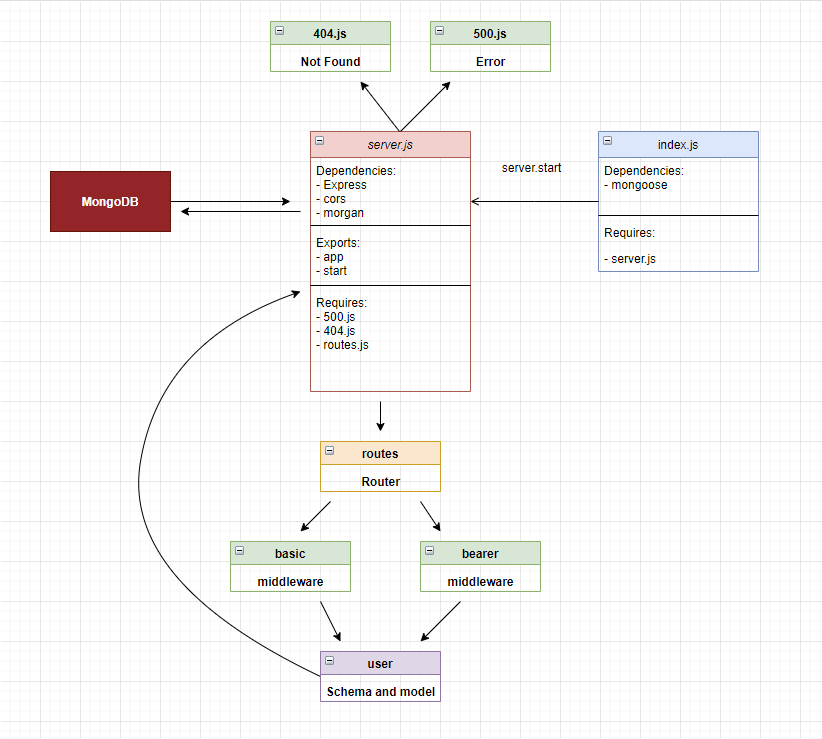

# bearer-auth

## Description

Task 1: Fix The Bugs

You will notice, by both attempting to start the server, as well as to run the tests … this server is a bit bug-ridden. Before you can tackle the task of securing the tokens, you must first get the server running.

Tests have been written for you. When they are all passing, you’re mostly there
Perform a manual validation of the server as well, so that you can be assured that you can interact with it as required

Task 2: Secure the JWT Tokens
Implement any 2 of these security measures, or any other measure that you can think of or have researched. Use a configuration option for these (i.e. an env setting) so that your system can handle multiple authorization schemes and easily turn them off/on

Some ideas:
Add support for the creation and usage of time sensitive (valid for 15 minutes) JWTs
Add support for the creation and usage of ‘single-use’ JWTs
With every authenticated access, re-send a new JWT token as a cookie or header
Disable those that you’ve already authenticated
Implement Sessions
Rather than store a user’s information in the token, create a “session” with an “id”
On the server, store lookup information in a session model using that ID
Sessions should timeout or be invalidated in some automated fashion
Add an additional layer of encryption

## Links

Heroku Link: https://basic-auth-yazan.herokuapp.com/

Github Actions: https://github.com/yazantafesh/bearer-auth/actions

Pull Request: https://github.com/yazantafesh/basic-auth/pull/1

## UML

## Task 2

1- Added time sensitive JWT (15 min)
2- Added an additional layer of encryption (extra encoding to the secret ENV VARIABLE)
